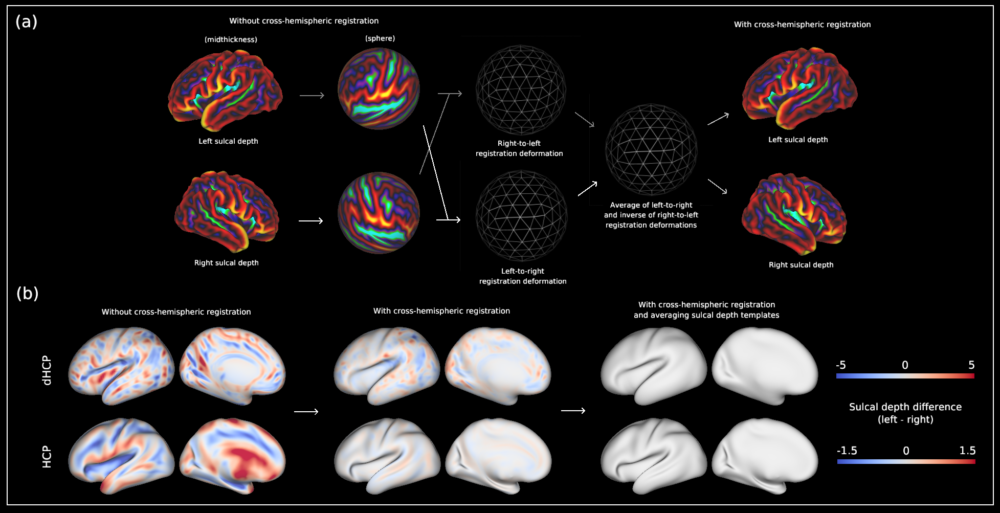

# Structural and functional asymmetry of the neonatal cerebral cortex



This is a repo containing files and scripts used in Williams, LZJ et al. (2022). Structural and functional cortical asymmetry of the neonatal cerebral cortex. _bioRxiv_. DOI: [https://doi.org/10.1101/2021.10.13.464206](https://doi.org/10.1101/2021.10.13.464206)

## Software used for cortical surface processing and analysis
1. [Multimodal surface matching (MSM)](https://github.com/ecr05/MSM_HOCR/releases)
2. [Connectome Workbench](https://www.humanconnectome.org/software/get-connectome-workbench)
3. [FSL GLM Setup](https://fsl.fmrib.ox.ac.uk/fsl/fslwiki/)
4. [FSL PALM](https://github.com/andersonwinkler/PALM)

## Steps for performing analysis

### 1. Cortical surface registration
First, cortical surfaces need to be registered from their native space to the fully-symmetrised templates contained in [metrics-lab/CorticalAsymmetry/Templates](https://github.com/metrics-lab/CorticalAsymmetry/tree/main/Templates). Registration is run using MSM, and is driven by cortical folding.

#### dHCP
Registration was performed using the scripts [here](https://github.com/ecr05/dHCP_template_alignment). The cortical surface deformations released as part of the 3rd dHCP release are **NOT** the same as the ones used in this manuscript (a further symmetrisation step was performed after release of the data). 

#### HCP-YA


### 1. Calculating surface area 
Cortical surface area not publicly released by dHCP or HCP-YA studies.

```bash
wb_command -surface-vertex-areas
```

### 2. Folding-based Cortical Surface Registration
Registration rerun for HCP-YA cohort

```bash
msm --inmesh=100206.L.sphere.rot.native.surf.gii \
    --refmesh=L.sphere.32k_fs_LR.surf.gii \
    --indata=100206.L.sulc.native.shape.gii \ 
    --refdata=/MSMSulc.refsulc.L.32k_fs_LR.shape.gii \
    --conf=config_standard_MSMstrain_0.03 \
    -o 100206.L.MSMstrain. 
```

Registration also re-run for dHCP (compared to 3rd release data), due to further symmetrisation step described in manuscript. 

```bash
dhcp_surface_processing.sh
```

### 3. Difference maps + smoothing
Calculating asymmetry indices per subject, and smoothing for structural measures. 

```bash
wb_command -metric-math '(x - y)/((x + y)/2)' <output> -var x <left hemi metric> -var y <right hemi metric> 

wb_command -surface-average <out surf> -surface <left midthickness> -surface <right midthickness>

wb_command -surface-smoothing <>

wb_command -metric-smoothing <> 
```

### 4. PALM
Can download PALM from [here](https://github.com/andersonwinkler/PALM). Need to specify to run with Octabe or MATLAB in [~/palm/palm](https://github.com/andersonwinkler/PALM/blob/master/palm). Requires files merged across subjects, for each modality. Order of merging should be same as the design matrix. Configuration used to run PALM for each experiment. 
